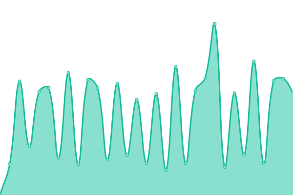
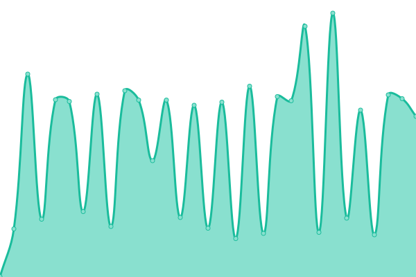
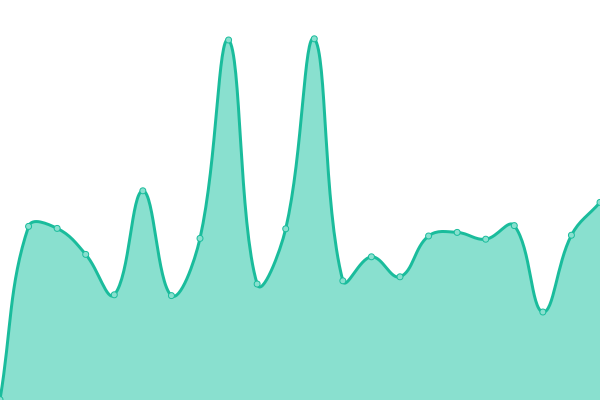
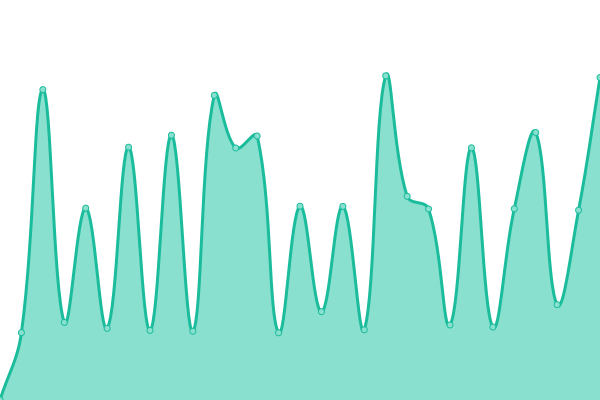
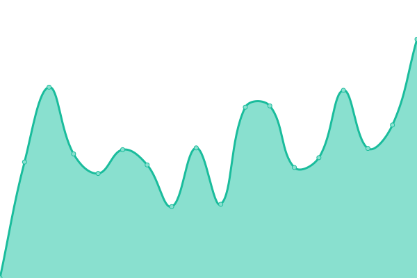

# [📈 Live Status](https://AerCitam.github.io/StatusPage): <!--live status--> **🟥 Complete outage**

This repository contains the open-source uptime monitor and status page for [AerCitam](https://AerCitam.github.io/StatusPage), powered by [Upptime](https://github.com/upptime/upptime).

With [Upptime](https://upptime.js.org), you can get your own unlimited and free uptime monitor and status page, powered entirely by a GitHub repository. We use [Issues](https://github.com/AerCitam/StatusPage/issues) as incident reports, [Actions](https://github.com/AerCitam/StatusPage/actions) as uptime monitors, and [Pages](https://AerCitam.github.io/StatusPage) for the status page.

<!--start: status pages-->
<!-- This summary is generated by Upptime (https://github.com/upptime/upptime) -->
<!-- Do not edit this manually, your changes will be overwritten -->
<!-- prettier-ignore -->
| URL | Status | History | Response Time | Uptime |
| --- | ------ | ------- | ------------- | ------ |
|  [Aer-Wsale](https://aer-wsale.com) | 🟥 Down | [aer-wsale.yml](https://github.com/AerCitam/StatusPage/commits/HEAD/history/aer-wsale.yml) | 

 673ms
     
 | 

<a href="https://AerCitam.github.io/StatusPage/history/aer-wsale">96.54%</a>
    

|  [DropShip API](https://aer-wsale.com/ws?action=apitest) | 🟥 Down | [drop-ship-api.yml](https://github.com/AerCitam/StatusPage/commits/HEAD/history/drop-ship-api.yml) | 

 936ms
     
 | 

<a href="https://AerCitam.github.io/StatusPage/history/drop-ship-api">96.54%</a>
    

|  [VapeInItaly](https://vapeinitaly.com) | 🟥 Down | [vape-in-italy.yml](https://github.com/AerCitam/StatusPage/commits/HEAD/history/vape-in-italy.yml) | 

 398ms
     
 | 

<a href="https://AerCitam.github.io/StatusPage/history/vape-in-italy">96.54%</a>
    

|  [Vapr. Store](https://vapr.store) | 🟥 Down | [vapr-store.yml](https://github.com/AerCitam/StatusPage/commits/HEAD/history/vapr-store.yml) | 

 1176ms
     
 | 

<a href="https://AerCitam.github.io/StatusPage/history/vapr-store">96.53%</a>
    

|  [Vapr.](https://vapr.it) | 🟥 Down | [vapr.yml](https://github.com/AerCitam/StatusPage/commits/HEAD/history/vapr.yml) | 

 1237ms
     
 | 

<a href="https://AerCitam.github.io/StatusPage/history/vapr">96.54%</a>
    

<!--end: status pages-->

[**Visit our status website →**](https://AerCitam.github.io/StatusPage)

## 📄 License

- Powered by: [Upptime](https://github.com/upptime/upptime)
- Code: [MIT](./LICENSE) © [AerCitam](https://AerCitam.github.io/StatusPage)
- Data in the `./history` directory: [Open Database License](https://opendatacommons.org/licenses/odbl/1-0/)
